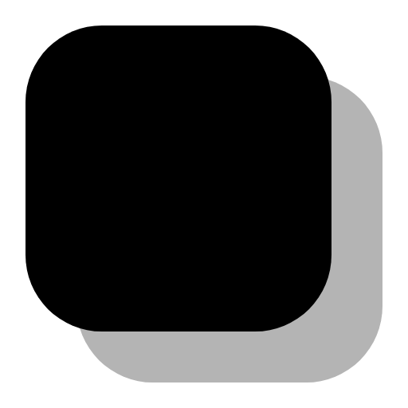
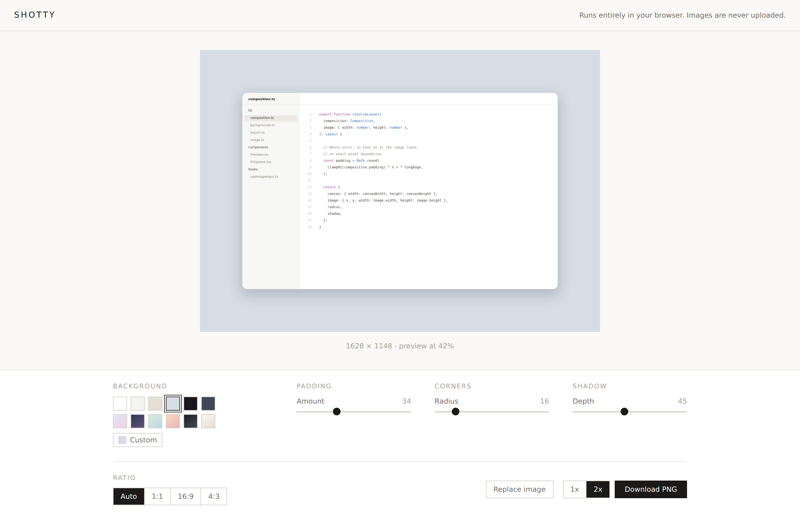

# Shotty

Add a background, padding, rounded corners and a shadow to a screenshot, then export it as a PNG.

**Everything runs in your browser.** Your image is never uploaded — there is no server to upload it to. No account, no watermark, no tracking. `next build` emits a static site, so the deployed app is nothing but HTML, CSS and JavaScript.



## Features

- **Paste, drop or pick** — `⌘V` / `Ctrl+V` straight after taking a screenshot
- **Backgrounds** — solid and gradient presets, any custom colour, or an image of your own
- **Padding, corner radius and shadow** — one slider each
- **Aspect ratio** — Auto, 1:1, 16:9, 4:3
- **PNG export at 1x or 2x** — redrawn from the original image data, not scraped off the page
- **Light and dark** — follows your system, with a switch to override it

## Local development

Requires Node 20 or newer.

```bash
npm install
npm run dev        # http://localhost:3000
```

Other scripts:

```bash
npm run build      # static export into ./out
npm run typecheck  # tsc --noEmit
npm run lint
```

`npm run build` produces a fully static `out/` directory. Deploy it to Vercel, or to any static host — GitHub Pages, Netlify, an S3 bucket, a USB stick.

## How it renders

The live preview is plain DOM and CSS, so dragging a slider updates on the next frame. Export is a separate path: it redraws the composition onto a `<canvas>` from the original decoded image, with the rounded corners applied as a real clip path. No DOM-screenshot library is involved, so the output is deterministic — the same settings give the same pixels in every browser.

A custom background image is read from your disk and decoded in the page, exactly like the screenshot itself — no fetch, and no photos are bundled with the app. It is scaled to **cover** the canvas and centred, cropping whichever axis overflows, which is the same rule CSS `background-size: cover` applies. There is no fit control in v1.

The UI theme is entirely separate from the artwork. The preview box and the exported PNG are painted from the `Composition` alone, so switching between light and dark cannot change a single pixel of the output — the export is byte-identical either way.

Both paths read one `Composition` object and derive their geometry from a single pure function, `resolveLayout()` in [`lib/composition.ts`](lib/composition.ts), so the preview and the PNG cannot drift apart. Geometry is stored in composition units where 1 unit is 1 pixel of the source image, which means a 2x export is exactly twice a 1x export, and a 1x export with padding, radius and shadow at zero is pixel-for-pixel identical to the image you put in.

## Roadmap

- Window chrome — macOS and browser frames
- Text and arrow annotations
- Multi-image layouts
- Saved presets

## Licence

MIT. See [LICENSE](LICENSE).
